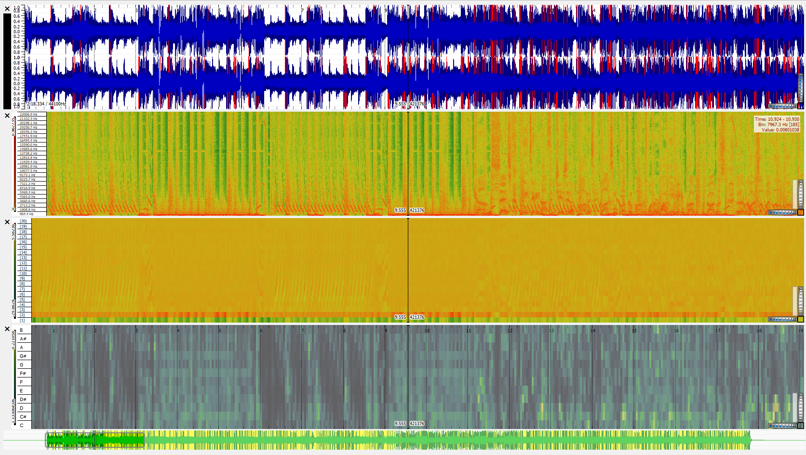

# Music Curation and Analytics
## Lab Portfolio
### by Charlie Todd

This repository is for a class entitled Music Curation and Analytics at the University of Glasgow.

## Week 1: Basics of Music Data

### Task 2

*Identify a theme for your dataset. This will be the central, cohesive strand that will bring your data together. It can be an artist, composer, songwriter, performer, album, larger work (i.e. opera, musical, etc.), time period, genre, archival grouping, etc. You will want to be sure that you can gather all three types of data based on your selected theme.*

For my dataset this semester, I am planning on compiling music that has been used in films and television that I enjoy, original compositions or not.  I have chosen this unifying theme because, while I certainly appreciate music for music’s sake, it is often more enjoyable either to form internalized associations between certain pieces of music and visual media (for example, Simple Minds and *The Breakfast Club*), or to be pleasantly surprised by favorite musical works appearing in new movies (for example, a performance of Nessun Dorma in a recent installment of *Mission Impossible*).  I also don’t want to limit myself to a particular genre or time period of music--I don’t know exactly what sorts of analyses we will be doing in later labs, but I want to have the option of working with all types of music, which is freely allowed by a theme such as this.  I may narrow down this theme later on, depending on my interests or any new ideas that come to mind.


### Task 3

*Describe the current manifestations of data relating to your selected theme. Has it already been curated somewhere? How is the data presented, described, and analysed?*

There are definitely pre-made playlists and albums  on Spotify containing metadata and acoustic data for movie hits in general and specific soundtracks/scores.  One example might be Hans Zimmer’s original score for *The Dark Knight*, available as an album in chronological order on Spotify, with basic information such as artist, duration, release date, etc.  Another example might be a user-made playlist containing the soundtrack used by, but not entirely composed for,  the Netflix original series called Bojack Horseman.  Original film scores may be hard to come by in notated form due to copyright laws, but that’s another reason I’ve left my theme broad enough to include older pieces used in popular films (like a number of classical blockbusters in *Fantasia 2000*).  These I would obtain from IMSLP, where the data is presented as sheet music in a database searchable by composer, style, era, and other filters, and upon selection of a piece, further organized by instrument and edition.  

Most of this data is not already analyzed; however, I have some experience with Spotify’s excellent Web API that exposes extensive data about tracks within the library of a given user (in this case myself), which I would love to leverage for the purposes of this assignment.  

## Week 2: Notation Basics

I have chosen to transcribe and arrange a 14-bar segment from "Light of the Seven" by Ramin Djawadi, featured in the Season 6 finale of *Game of Thrones*.  [Click here for the raw data](./Light_of_the_Seven.mscz)

## Week 3: Encoding Basics for Notation

[Click here to see my transcription presented with Verovio.](https://cptodd757.github.io/MCA-2019/verovio.html)

## Week 4: Computational analytics of notated music

| Category      | Value           
| ------------- |:-------------:|
| Number of Pitches     | 30 |
| Number of Pitch Classes     | 9      |
| Range | 48    |
| Mean Pitch | 64.89 |
| Most Common Pitch | 67 |
| Relative Prevalence of Top Pitches | .963 |
|Mean Melodic Interval | 9.647 |

These are some of the highlights from the jSymbolic I generated for "Light of the Seven".  One thing that is interesting is the difference between the most common pitch (67, which is a G) and the mean pitch (64.89)--the fact that the latter is lower is indicative of the presence of more lower notes, which in this case, are played by the two cellos.  I also notice that the "Relative Prevalence of Top Pitches" has an exceptionally high value (.963), which can be explained by the fact that the left hand on the piano is always arpeggiating a chord, and many of the chords used in this piece predictably include C or G, which comprise the "top pitches" in this piece.  The Mean Melodic Interval also warrants attention because it seems rather high--assuming this is measured in semitones--but it, too, can be explained by the arpeggiation in the left hand, which routinely makes jumps of 7 or 8 semitones.  

Below is a  piano roll for this piece:


And here, a histogram of the pitches used in the piece:


This histogram plainly provides an illustration of that high frequency of top pitches observed earlier, through the prevalence of C in many octaves as well as the G5 that is featured heavily in the piano left hand.

## Week 5: Standards in curation

The schema I created was largely in line with what was available at https://music-encoding.org/guidelines/v4/content/metadata.html, with omissions made where necessary, e.g. publishing info for a transcription I have not published, information regarding authors of written works or pieces with lyrics, etc.  The file that uses this schema can be viewed [here](./Week_5/Light of the Seven, New Metadata.mei), or, more conveniently, in my later writeup for Week 7.

Below is a snippet from the file:

```
<meiHead>
        <fileDesc>
            <titleStmt>
                <title>
                    Light of the Seven
                </title>
                <title type="subtitle"> 
                    from Game of Thrones 
                </title>
                <arranger>
                    Charles Todd
                </arranger>
                <composer>
                    Ramin Djawadi
                </composer>
                <respStmt>
                    <resp>Transcribed and encoded by</resp>
                    <name>Charles Todd</name>
                </respStmt>
                <respStmt>
                    <resp>Class project assigned by</resp>
                    <name authURI="https://moodle.gla.ac.uk/course/view.php?id=18045"> University of Glasgow</name>
                </respStmt>
            </titleStmt>
            <editionStmt>
                <edition>
                    First draft, only one segment from the piece.
                </edition>
            </editionStmt>
            <extent unit="byte">
                50800
            </extent>
            <pubStmt>
                <unpub>
                This file has yet to be published.
                </unpub>
            </pubStmt>
            <sourceDesc>
                <source>
                    <head>
                        File produced by MuseScore.
                    </head>
                    <bibl authURI="https://open.spotify.com/album/7bBlW6L9r3ICFkbf2WRDXL?highlight=spotify:track:6iLzFJhs4ATwJn7P1utZIJ">
                        Music transcribed from audio recording on Spotify.
                        https://open.spotify.com/album/7bBlW6L9r3ICFkbf2WRDXL?highlight=spotify:track:6iLzFJhs4ATwJn7P1utZIJ
                    </bibl>
                </source>
            </sourceDesc>
        </fileDesc>
        <encodingDesc xml:id="encodingdesc-0000000292973141">
            <appInfo xml:id="appinfo-0000001852410459">
                <application xml:id="application-0000001820475887" isodate="2019-10-15T13:03:04" version="2.2.0-dev-c01b3a1-dirty">
                    <name xml:id="name-0000000990935870">Verovio</name>
                    <p xml:id="p-0000001813806678">Transcoded from MusicXML</p>
                </application>
            </appInfo>
            <projectDesc>
                This file exists as an exploration of music curation for the class at University of Glagsow called Music Curation and Analytics.
            </projectDesc>
            <samplingDecl>
                <p>Encoding contains 16 measures that were deemed the best combination of interesting and achievable for the purposes of this project.</p>
            </samplingDecl>
        </encodingDesc>
        <workList>
            <work>
                <key>
                    C minor
                </key>
                <meter>
                    2/2
                </meter>
                <tempo>
                    Moderato
                </tempo>
                <creation>
                    File created on October 24, 2019.
                </creation>
                <history>
                    <eventList>
                        <event>
                            Song released on Spotify on June 24, 2016.
                        </event>
                    </eventList>
                </history>
                <perfMedium>
                    <perfResList>
                        <perfRes count="1">Piano</perfRes>
                        <perfRes count="2">Cello</perfRes>
                    </perfResList>
                </perfMedium>
            </work>
        </workList>
    </meiHead>
  ```

## Week 6

Reading week!

## Week 7: Challenges to music curation

This week, I added some information to my MEI file, notably a genre tag to describe this piece as soundtrack, as well as a responsibility statement within the title statement that credits *Game of Thrones* with having commissioned the composition of this piece.  Click [here](./myMeta.html) to view the header, along with a Verovio rendering of the sheet music.

## Week 8: Music as sound

For the final three weeks, the three songs I have selected to analyze are the third movement of Beethoven's Ninth Symphony, "What's Wrong with Me" by Marwood Williams, and "The 5th Dimensional Psy Ops Unit" by Truth Serum.  I selected the Beethoven piece in an attempt to stay in line with my theme of movie and television music, because it plays a key role in *A Clockwork Orange* by Stanley Kubrick, and it's also one of my favorite pieces as an orchestral musician.  However, since I needed to select pieces from different genres, but any movie music that isn't classical is very unlikely to be in the public domain, I chose a couple of other songs from freemusicarchive.org instead.  The Williams song is a country song that I, as a critic of country music, find to be aptly titled, and the Truth Serum song is a rap song that I chose because of the absurd-sounding name.  

Below is a table of relevant metadata for each of these songs.  

| Artist |	Composer |	Genre |	Source |	File format | 	number of channels	| sample rate |	bit per second |	duration |	size |
| - | - | - | - | - | - | - | - | - | - |
| Royal Concertgebouw Orchestra |	Ludwig van Beethoven |	Classical |	IMSLP	| mp3 |	2	| 48000 |	112 kbps |	0:14:48	| 11.9 MB |
| Truth Serum	| Truth Serum |	Rap	| freemusicarchive |	mp3	| 2 |	44100 |	320 kbps |	0:02:18	| 5.45 MB |
| Marwood Williams |	Marwood Williams |	Country |	freemusicarchive |	mp3 |	2 |	44100 |	320 kbps	| 0:03:57 |	9.07 MB |

And next, the waveforms and spectrograms for each of the songs.

Beethoven:


Marwood Williams:


Truth Serum:


One advantage of a time-frequency analysis over just a waveform-based analysis is fairly inherent to the name--that is, it enables us to visualize information about each of the frequencies that comprise a signal.  With just the waveform, it is easy to track changes in overall volume by observing the changes in amplitude, but with the spectrogram, it is possible to observe these changes in volume for all the different frequencies, by looking at the intensity of the colors.  

For example, in the excerpt from Beethoven's Ninth Symphony, the waveform clearly reflects three loud bursts of energy at the beginning of the movement.  However, when one looks at the spectrogram, it is apparent that there are actually four loud bursts (two from the orchestra, then one from the timpani, then another from the orchestra), more or less playing the notes D, A, F and D in order.  The fact that the spectrogram illustrates amplitude with specific respect to the different frequencies allows us to distinguish between the third and fourth bursts, which the waveform does not.

## Week 9: Analysing and Extracting Meaning from Audio

### Task 1

Below are screenshots of the Sonic Visualizer sessions for each of the three songs, featuring the waveforms, spectrograms, mel frequency cepstral coefficients, and chromagrams.

Beethoven:


Marwood Williams:


Truth Serum:



### Task 2

Below are histograms representing the spectrograms, mel frequency cepstral coefficients, and chromagrams of the three songs.

| | Spectrogram | MFCC | Chromagram |
| - | - | - | - |
| Beethoven |  | |  |
| Williams |  | |  |
| Truth Serum |  | |  |

*Insert interpretation of comparison of either chromagrams or MFCCs here.*

## Week 10: Audio Similarity and Transcription

### Task 1

Below is a similarity matrix comparing 10 songs, 7 of which were provided, and 3 of which are the three songs I selected above.


The final three tracks are, in order, Beethoven, Williams, and Truth Serum.  The Beethoven and Williams are surprisingly similar to each other, in terms of relative occurrence of different pitches, appearing to strike a balance between the first four songs (classical) and the next three (rock).  But, it is blatantly obvious that the Truth Serum song is wildly different from all the others, which is likely due to the fact that, as a rap song, its relative usage of any pitches at all should be different from any sort of sung or melodic music.  It also has lots of laser-like sounds in the background that don't seem to pay any respect to the notion of pitch.

### Task 2

Below is an image of my transcription of Light of the Seven, and below that is an image of Sonic Visualizer's transcription of the audio generated by MuseScore for my transcription.  

*insert the images here*

My transcription features a piano and two cellos.  However, when I tried feeding the audio into Sonic Visualizer to transcribe it, when I viewed the result, it looked absolutely horrendous—weird rhythms, and not the right key signature.  I thought it might be due to some confusion about what notes the cellos were playing, since they were mediocre-quality synthesized cellos from MuseScore that were sustaining notes for the whole piece, and also using a lot of computerized vibrato.  So, I took the cellos out and retried the transcription, which now looks much better (although still very far away from 100% accurate).  It extracted the right tempo and the right overall rhythms, but it still identified the overall key as B minor instead of C minor, so a lot of the notes are exactly a half step too low—this could be due to discrepancies between what frequency bands constitute a “pitch” in MuseScore versus Sonic Visaulizer (sort of like how Baroque orchestras use an A that is lower than 440 Hz).

This concludes my lab portfolio.


